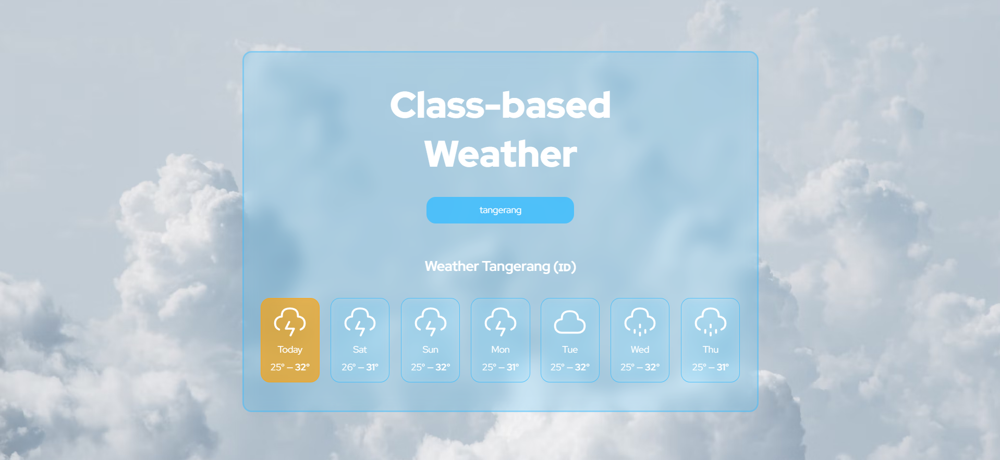

# Class-Based Weather App

Aplikasi ini lahir dari rasa ingin tahu saya tentang React di masa lalu, saat pendekatan class-based masih menjadi pilihan utama. Dengan banyaknya boilerplate, aplikasi ini memberikan pengalaman yang berbeda dalam menulis kode, di mana setiap komponen terasa lebih eksplisit dan terstruktur. Meskipun tampak lebih rumit, pendekatan ini membuka wawasan lebih dalam tentang bagaimana React berkembang dari hari ke hari.

## Fitur Utama

- **Pencarian Lokasi**: Pengguna dapat mencari lokasi menggunakan nama kota atau negara untuk mendapatkan informasi cuaca terkini.
- **Cuaca Harian**: Menampilkan suhu maksimum dan minimum untuk beberapa hari ke depan, bersama dengan ikon cuaca yang menggambarkan kondisi cuaca.
- **Berbasis Class-based React**: Menggunakan class-based components yang memberikan pendekatan klasik dalam pembangunan aplikasi React, berbeda dari penggunaan hooks pada umumnya.
  
## Teknologi yang Digunakan

- **React**: Framework untuk membangun UI dinamis.
- **Open Meteo API**: Digunakan untuk mendapatkan data cuaca terkini dan ramalan cuaca.
- **Geocoding API**: Untuk mengonversi nama lokasi menjadi koordinat geografis.

## Cara Menjalankan Aplikasi

1. Clone repository ini ke mesin lokal Anda:

   ```bash
   git clone https://github.com/Anntasena/PROJECT-Class-based-weather.git
